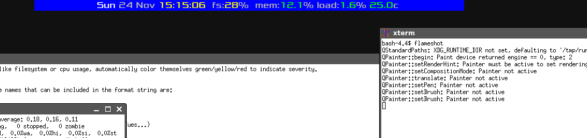
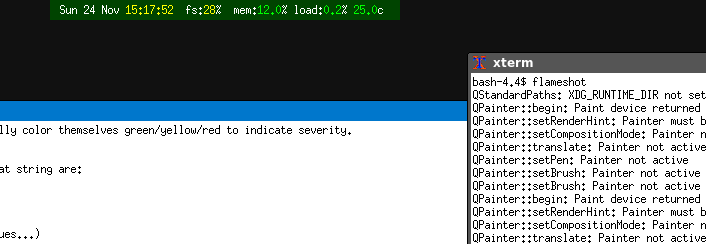
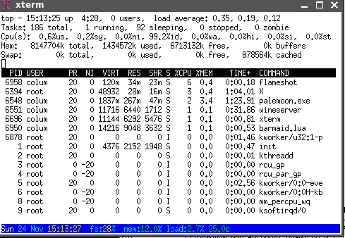
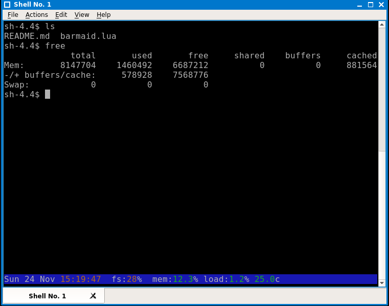

Barmaid.lua - a status bar tool for dzen2, lemonbar, xterm titles and ansi terminal
====================================================================

SYNOPSIS
========

barmaid.lua is a status-bar generation program written in lua using libUseful-lua. It can generate output suitable for dzen2, lemonbar, xterm title-bars and the terminal. It can display info on date, time, system load, memory usage, partition usage, cpu usage, ip4 address/netmask/broadcast, hostname, kernel, architecture, ostype, uptime, cpu count, battery level, and cpu temperature. No external programs are run to generate this data, so barmaid's resource usage should be low. Unfortuantely, as barmaid pulls a lot of data from /proc and /sys, it's a mostly linux-only program.

INSTALL
=======

You'll need to install libUseful (https://github.com/ColumPaget/libUseful) and libUseful-lua (https://github.com/ColumPaget/libUseful-lua) 

USAGE
======

```
lua barmaid.lua [-t output_type] [-type output_type] [-x xpos] [-y ypos] [-w width] [-h height] [-bg color] [-fg color] [-fn font] [-font font] [format string]
```

online help can be called up with 'lua barmaid.lua -help' 

the `-t` or `-type` option sets the output type, which can be 'dzen2', 'lemonbar', 'xterm', 'terminal' or 'term'. 

The `-x`, `-y`, `-w` and `-h` options set the x and y position of the bar, and its width and height, in pixels. The `-x` position option can also accept 'left', 'right' and 'center' as screen positions. The `-y` option can accept `top` and `bottom`, with the `bottom` argument causing special behavior in terminal mode (see below). None of these work in 'xterm' mode.

The `-bg` and `-fg` options set the foreground and background colors of the bar, which (accept for terminal mode) is expressed in rrggbb hexadecimal format with or without a leading '#' (if using a '#' you'll have to put the color string in single-quotes or the shell will treat it as a comment). In terminal mode colors are expressed by name, such as 'blue', 'red' etc. Colors are sadly not available in xterm mode.

`-fn` or `-font` set the font to use, this can differ a bit in format with dzen2 accepting short fontconfig names (use `fc-list` to list these), whereas lemonbar uses old-style X11 font names (use `xlsfonts` to see a list of these for your system). Again, this feature is not available for xterm titles.

Finally the `format string` is the string to display. Values within `$()` will be substituted by the program with the appropriate data, like this:

```
	$(time) $(hostname) $(fs:/) $(date)
```

Colors within this format string can be set using libUseful `~` notation, where the next character is the color prefix. Available colors are:

```
~w  white
~n  black 
~b  blue
~c  cyan
~g  green
~y  yellow
~m  magenta
~r  red
~0  reset to default color
```
The uppercase version of these sets the background instead of the foreground color. 


So, for example:

```
		~bdisk:~0 $(fs:/)  ~bmem:~0 $(mem)
```

Will display the words 'disk:' and 'mem:' in blue, in front of the values for root-partition usage and memory usage, which will be in the default color.

Some values, like filesystem or cpu usage, automatically color themselves green/yellow/red to indicate severity.


Avaiable value names that can be included in the format string are:

```
time           display time as %H:%M:%S
date           display date as %Y/%m/%d
day_name       display 3-letter day name (Sun, Mon, Tues...)
month_name     display 3-letter month name
hour        
minutes
seconds
year
month
day
hostname       system hostname
arch           system architecture
os             system os type
kernel         kernel version number
uptime         system uptime in $H:%M:%S
cpu_count      number of cpus
cpu_temp       cpu temperature in celsius. Currently only works on systems that have x86_pkg_temp or coretemp type sensors. For multicore systems displays the highest across all CPUs.
mem            percent memory usage
usedmem        used memory in metric format 
freemem        free memory in metric format
totalmem       total memory in metric format
swap           percent swap space usage
usedswap       used swap in metric format
freeswap       free swap in metric format
totalswap      total swap in metric format
bat:           percentage remaining battery. This requires a battery number suffix, so `$(bat:0)` for the first battery
charging:      returns the character '~' (to look like an 'AC' symbol) if battery is charging. Requires a battery number suffix
bats           info for all batteries. If no batteries present, this will be blank.
fs:            filesystem use percent. Requires a filesystem mount suffix, so `$(fs:/home)` for filesystem on /home
load_percent   system percentage load/cpu usage
load           instantaneous load/cpu usage in 'top' format
load1min       1min load in 'top' format
load5min       5min load in 'top' format
load15min      15min load in 'top' format
ip4address:    ip4address. Requires a network interface suffix, e.g. `$(ip4address:eth0)`
ip4netmask:    ip4address. Requires a network interface suffix, e.g. `$(ip4address:eth0)`
ip4broadcast:  ip4address. Requires a network interface suffix, e.g. `$(ip4address:eth0)`

```

Please note, any value that has ':' at the end, takes an argument, like `bat:1` or `ip4address:eth0`.

The 'ip4' values have a special case where the interface is specified as 'default' e.g. 'ip4address:default'. In this case details are returned for the first interface that isn't the local interface and has an ip address. 


TERMINAL BOTTOM BAR
===================

If barmaid is run in a terminal with the `-y` argument set to `bottom`, like so:

```
	lua barmaid.lua -t term -y bottom -bg blue
```

Then a bar will be displayed at the bottom of the terminal, with normal terminal output being limited to the lines above it. This is an experimental feature. It's been seen to work in xterm and qterminal, though 'vi' in xterm seems to have some cosmetic issues.


MODULES
=======

Since version 3.0 barmaid supports modules. These are small lua scripts placed in a directory (/usr/local/lib/barmaid/) that can be used to add new types of information to be displayed. Two example modules already exist 'aurorawatch.lua' and 'isc.lua', displaying the aurorawatch status and Internet Storm Center Threat Level respectively. Modules work by putting an object into the table 'lookup_modules'. This object must have a '.init' function. This function will be called and passed a table and a 'display string'. This string contains all the variables that are needed to display the bar. The module should check if the variable it will provide is in the list, and if so add a 'lookup' function to the supplied 'lookups' table. This lookup function will then be called when the data is needed. The module should get the data and put it into the table 'display_values' under the name that it will be called as. For instance, the Internet Storm Center threat level can be looked up via the variable '$(isc)' and so it's value is put into the 'display_values' table like this:

```
	display_values["isc"]=value
```

Some values, particularly those looked up via the internet, should not be looked up on every call of the lookup function. To assist with this there's a global 'lookup_counter' value that counts seconds since program startup. 


SCREENSHOTS
===========

## DZen



## Lemonbar



## Xterm



## QTerminal



