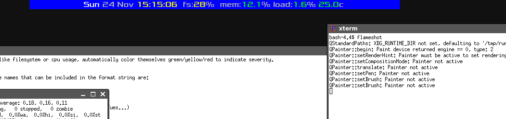
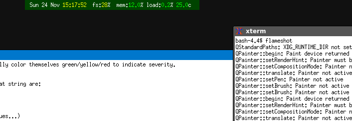
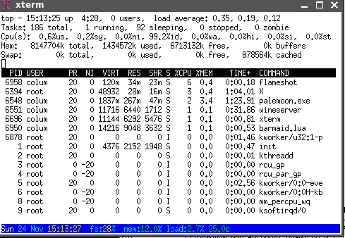

Barmaid.lua - a status bar tool for dzen2, lemonbar, xterm titles, dwm and ansi terminal
====================================================================

SYNOPSIS
========

barmaid.lua is a status-bar generation program with unicode and modules support. It is written in lua using libUseful-lua. It can generate output suitable for dzen2, lemonbar, xterm title-bars, dwm and the terminal. It can display info on date, time, system load, memory usage, partition usage, cpu usage, ip4 address/netmask/broadcast, hostname, kernel, architecture, ostype, uptime, cpu count, battery level, and cpu temperature. No external programs are run to generate this data, so barmaid's resource usage should be low. Unfortuantely, as barmaid pulls a lot of data from /proc and /sys, it's a mostly linux-only program. Barmaid is extensible via its modules system.


INSTALL
=======

You'll need to install libUseful (https://github.com/ColumPaget/libUseful) and libUseful-lua (https://github.com/ColumPaget/libUseful-lua) 

The program consists of one big script 'barmaid.lua'. The code is broken into parts, and can be built using the supplied makefile by typing 'make'.

Either run barmaid.lua using 'lua barmaid.lua' or use the linux binfmt system to auto invoke it.

Extension modules (supplied in the 'modules' subdirectory)  currently go in /usr/local/lib/barmaid/


USAGE
======

```
lua barmaid.lua [-t output_type] [-type output_type] [-x xpos] [-y ypos] [-w width] [-h height] [-a align] [-bg color] [-fg color] [-fn font] [-font font] [-kvfile path] [-sock path] [-icon-path] [format string]
```

online help can be called up with 'lua barmaid.lua -help' 

the `-t` or `-type` option sets the output type, which can be 'dzen2', 'lemonbar', 'dwm', 'xterm', 'terminal' or 'term'. 

The `-x`, `-y`, `-w` and `-h` options set the x and y position of the bar, and its width and height, in pixels. The `-x` position option can also accept 'left', 'right' and 'center' as screen positions. The `-y` option can accept `top` and `bottom`, with the `bottom` argument causing special behavior in terminal mode (see below). None of these work in 'xterm' mode.

The `-a` option sets text alignment, and can be 'left', 'right' or 'center'.

The `-bg` and `-fg` options set the foreground and background colors of the bar, which (accept for terminal mode) is expressed in rrggbb hexadecimal format with or without a leading '#' (if using a '#' you'll have to put the color string in single-quotes or the shell will treat it as a comment). In terminal mode colors are expressed by name, such as 'blue', 'red' etc. Colors are sadly not available in xterm mode.

`-fn` or `-font` set the font to use, this can differ a bit in format with dzen2 accepting short fontconfig names (use `fc-list` to list these), whereas lemonbar uses old-style X11 font names (use `xlsfonts` to see a list of these for your system). Again, this feature is not available for xterm titles.

The `-kvfile` option specifies the path to a file that contains key-value pairs in the form:

```
name1=value1
name2=value2
```

This allows setting arbitary values to be displayed. So one could set the value 'days2christmas' by adding the line:

```
days2christmas=13
```

and this can then be displayed by adding the `Â$(days2christmas)` variable to the format/display string.

The `-sock` option specifies a path to a unix socket that other programs can connect to and send name-value pairs that can then be used in the format string, using the same message format format as for -kvfile.

Both `-kvfile` and `-sock` support special name-value pairs whose name begins with '@'. These are treated as counters, so that instead of storing the sent value, the counter increments. If a blank string is sent as the value, the counter will reset to zero. 

Both `-kvfile` and `-sock` support special name-value pairs whose name begins with '>'. These work like the counters above, but in addition are stored as lists in files at '~/.barmaid/<name>.lst'. An on-click can then be used to launch some program that will display the list.  If a blank string is sent as the value the counter will reset to zero and the list will be cleared. 

Finally the `format string` is the string to display. Values within `$()` will be substituted by the program with the appropriate data, like this:

```
	$(time) $(hostname) $(fs:/) $(date)
```

As the '$' symbol means something to the shell, the format string will have to be supplied within single quotes if passed on the command line. Alternatively the format '^(' can be used instead of '$(', like so:

```
	^(time) ^(hostname) ^(fs:/) ^(date)
```


Colors within this format string can be set using libUseful `~` notation, where the next character is the color prefix. Available colors are:

```
~w  white
~n  black 
~b  blue
~c  cyan
~g  green
~y  yellow
~m  magenta
~r  red
~0  reset to default color
~Uxxxx   unicode code point
~:name:  unicode glyph name
```
The uppercase version of these sets the background instead of the foreground color. 


So, for example:

```
	~bdisk:~0 $(fs:/)  ~bmem:~0 $(mem)
```

Will display the words 'disk:' and 'mem:' in blue, in front of the values for root-partition usage and memory usage, which will be in the default color.

```
	~R~w$(hour):$(minutes)~0 $(date)
```

Will display the time (hours and minutes) in white on a red background, and the date with the default colors.

Unicode glyphs can be included with the `~:#` notation. Please see the 'UNICODE' section below for more details.

Dzen2 supports images, and these can be set with the notation `~i{/usr/share/icons/world.jpg}`. Dzen2 only supports .xpm images, so barmaid.lua will use the ImageMagick 'convert' utility to convert .png or .jpg 

Some values have alternative versions that are suffixed with ':color'. These values are automatically colored according to their numeric values. Values can also be modified for display using the 'reformat module' method discussed in the 'MODULES' section below.


Available value names that can be included in the format string are:

```
time             display time as %H:%M:%S
date             display date as %Y/%m/%d
day_name         display 3-letter day name (Sun, Mon, Tues...)
month_name       display 3-letter month name
hour        
minutes
seconds
year
month
day
hostname         system hostname
arch             system architecture
os               system os type
kernel           kernel version number
uptime           system uptime in $H:%M:%S
cpu_count        number of cpus
cpu_temp         cpu temperature in celsius. Currently only works on systems that have x86_pkg_temp or coretemp type sensors. For multicore systems displays the highest across all CPUs.
cputemp:color    automatically colored cpu usage (green/yellow/red)
cpu_freq:<cpuid> frequency of cpu, where <cpuid> has the form 'cpu0', 'cpu1' etc
cpu_freq:avg     avergae cpu frequency across all cpus

mem              percent memory usage
memuse           percent memory usage using 'availmem' (see discussion below for difference from 'mem')
free             percent memory free
avail            percent memory free (see discussion below for difference from free)
mem:color        automatically colored memory usage (green/yellow/red)
memuse:color     percent memory usage using 'availmem' (see discussion below for difference from 'mem')
free:color       automatically colored percent memory free
avail:color      percent memory available (see discussion below for difference from free)
usedmem          used memory in metric format 
freemem          free memory in metric format
availmem         free memory in metric format (see discussion below for difference from freemem)
totalmem         total memory in metric format
swap             percent swap space usage
swap:color       automatically colored swap usage (green/yellow/red)
usedswap         used swap in metric format
freeswap         free swap in metric format
totalswap        total swap in metric format
bat:<num>        percentage remaining battery. This requires a battery number suffix, so `$(bat:1)` for the first battery
bat:<num>:color  automatically colored swap usage (green/yellow/red) example: $(bat:1:color)
charging:        returns the character '~' (to look like an 'AC' symbol) if battery is charging. Requires a battery number suffix
bats             info for all batteries. If no batteries present, this will be blank.
bats:color       autocolored info for all batteries. If no batteries present, this will be blank.
fs:<mount>       filesystem use percent. Requires a filesystem mount suffix, so `$(fs:/home)` for filesystem on /home
load_percent     system percentage load/cpu usage
load_percent:color    autocolored system percentage load/cpu usage
load:color       instantaneous load/cpu usage in 'top' format
load1min         1min load in 'top' format
load5min         5min load in 'top' format
load15min        15min load in 'top' format
ip4interface:    requires the suffix 'default', so 'ip4interface:default' returns name of interface that has the ip4 default route
ip4address:      ip4address. Requires a network interface suffix, e.g. `$(ip4address:eth0)` or `$(ip4address:default)` for ip address on default-route interface
ip4netmask:      ip4netmask. Requires a network interface suffix, e.g. `$(ip4netmask:eth0)``$(ip4netmask:default)` for ip netmask on default-route interface
ip4broadcast:    ip4broadcast. Requires a network interface suffix, e.g. `$(ip4broadcast:eth0)`
up:<host>:<port> connect to service at 'host' and 'port'. display 'up' if connection succeeds, 'down' if not
dns:<host>       lookup 'host' and return its IP address              
dnsup:<host>     lookup 'host' and return 'up' if a value is returned 'down' if not
```

Please note, any value that has ':' at the end, takes an argument, like `bat:1` or `ip4address:eth0`.

'freemem and 'availmem', 'free' and 'avail', and 'mem' and 'memuse' differ. ''freemem', free' and 'mem' are calcluated to align with the output of the command-line 'free' command. 'availmem', 'avail' and 'memuse' are calculated from the /proc/meminfo 'MemAvailable' entry. Usually there should be little difference between these, but one cause of a difference is ramdisks. If you have a tmpfs ramdisk on, say /tmp, and its consuming a lot of memory (perhaps because it contains large files) 'freemem' and 'mem' will show you have plenty of memory, even though you don't, as they will not be aware of memory consumed by the ramdisk. 'availmem' and 'memuse' will be a truer reflection of memory available. If you display both these values, and see a large difference between them, then perhaps you need to check your ramdisks!

The 'ip4' values have a special case where the interface is specified as 'default' e.g. 'ip4address:default'. In this case details are returned for the first interface that isn't the local interface and has an ip address. 


TERMINAL BOTTOM BAR
===================

If barmaid is run in a terminal with the `-y` argument set to `bottom`, like so:

```
	lua barmaid.lua -t term -y bottom -bg blue
```

Then a bar will be displayed at the bottom of the terminal, with normal terminal output being limited to the lines above it. This is an experimental feature. It's been seen to work in xterm and qterminal, though 'vi' in xterm seems to have some cosmetic issues.

UNICODE
=======

Barmaid supports unicode UTF8 output. Unicode symbols can be included by either:

1) Unicode code-point value. so, for example "~U266B" displays a musical note symbol.
2) Unicode glyph name. This requires a version of libUseful more recent than 4.38 and an '/etc/unicode-names.conf' file. This allows specifying unicode symbols via the notation: "~:music:"


VALUE TRANSLATION
=================

There are a two ways to translate a datavalue into something else for display. For instance, some datavalues hold the string 'up' or 'down' to indictate the state of something. Reformat modules are lua plug-ins used to perform this task and are discussed in the 'MODULES' section below. The other method for translating such values is the '-tr' command-line option, or the 'translate' config-file option. In both cases this system uses a configuration string of the form:

```
  <value>|<translation>
```

So for example, the following:

```
  up|~g up ~0
```

Could be used to color the string 'up' in green (for clarity extra spaces are added around 'up' in the translation). This method could also be used to map 'up' to an icon:

```
  up|~i{/usr/share/icons/okay.jpg}
```

This would map all values that consist of the word 'up' to the specified icon.

Sometimes there's a need to specify which value is being translated. Multiple different data lookups could return the same value, and you might want to color them differently. This is achieved with:

```
  <name>=<value>|<translation>
```

Where 'name' is the name of a value, and 'value' is it's actual displayed result. E.g.

```
  up:google.com:80=up|~gG~0
```

Could be used to supply a green 'G' to indicate google is accessible, but not interfere with any other values that return 'up'.

The 'key' of the translation (i.e. 'name=value') can contain shell/fnmatch-style wildcards. The symbols `*`, `+`, `?`, `[` and `]` will be honored with their shell/fnmatch meanings. `\` can be used to quote these characters.

EXAMPLE:

```
  barmaid.lua 'dns:$(dnsup:google.com)  $(up:google.com:80) $(up:freshcode.club:80) $(up:kernel.org:80)' -tr 'dnsup:google.com=up|~gup~0' -tr 'dnsup:google.com=down|~rDOWN~0' -tr 'up:google.com:80=up|~gG~0' -tr 'up:freshcode.club:80=up|~gF~0' -tr 'up:kernel.org:80=up|~gK~0'
```

This allows mapping the value 'up' for different variables to different output strings (admittedly all of them green in color).


MODULES
=======

Since version 3.0 barmaid supports modules. These are small lua scripts placed in a directory (default path /usr/local/lib/barmaid/:/usr/lib/barmaid:~/.local/lib/barmaid) that can be used to extend barmaid's functionality. Two types of module exist: 'Information modules' that add new types of information to be displayed, and 'Reformat modules' that color, translate or otherwise modify the values to be displayed. 

Two example information  modules already exist 'aurorawatch.lua' and 'isc.lua', displaying the aurorawatch status and Internet Storm Center Threat Level respectively. Modules work by putting an object into the table 'lookup_modules'. This object must have a '.init' function. This function will be called and passed a 'lookups' table and a 'display string'. This string contains all the variables that are needed to display the bar. The module should check if the name of the variable it will provide is in the string, and if so add a 'lookup' function to the supplied 'lookups' table. This lookup function will then be called when the data is needed. The module should get the data and put it into the table 'display_values' under the name that it will be called as. For instance, the Internet Storm Center threat level can be looked up via the variable '$(isc)' and so it's value is put into the 'display_values' table like this:

```
	display_values["isc"]=value
```

Some values, particularly those looked up via the internet, should not be looked up on every call of the lookup function. To assist with this there's a global 'lookup_counter' value that counts seconds since program startup. 

'Reformat' modules are modules intended for the use of changing the displayed value that's output to the bar. Instead of being added to 'lookup_modules' table the object is added to the 'display_modules' table. The don't need an 'init' function, and the object aded to the 'display_modules' table only needs to contain as single function called 'process'. This function is called for every lookup value/type, and is passed the variables 'name' and 'value', representing the name and value of each variable that's going to be displayed. The function either returns 'value' unchanged, or else return some kind of translated value.

An example 'reformat' module is also provided in the distribution.


CONFIG FILE
===========

By default barmaid looks for config files in `~/.config/barmaid.lua/barmaid.conf`, `~/.config/barmaid.conf`, `~/.barmaid.conf` and `/etc/barmaid.conf`. The '-c' command-line option allows changing this search path, like so:

```
  barmaid.lua -c /config/barmaid.conf:~/etc/barmaid.conf:/usr/local/etc/barmaid.conf
```
The config file contains entries of the form:                                                                                      

```                                                                                                                                  <config type> <value>                                                                                                            ```  

Possible config types are:

```
display            string to be displayed in the bar
display-string     string to be displayed in the bar
output             output type, 'dzen2', 'lemonbar', 'dwm', etc
outtype            output type, 'dzen2', 'lemonbar', 'dwm', etc
xpos               x-position, can be 'left', 'right', 'center' or a pixel-position
ypos               y-position, can be 'left', 'right', 'center' or a pixel-position
width              bar width in pixels
height             bar height in pixels
align              text alignment, can be 'left', 'right' or 'center'
font               name of font to use in the bar
fn                 name of font to use in the bar
foreground         default foreground color
fg                 default foreground color
background         default background color
bg                 default background color
translate          translate a value to another (see --help-translations)
tr                 translate a value to another (see --help-translations)
kvfile             path to a key-value file
icon-path          colon-separated search path to find icons
icon_path          colon-separated search path to find icons
iconpath           colon-separated search path to find icons
datasock           path to a datasocket to receive key=value messages on
onclick            configure an 'onclick' (see --help-onclick)
```

An example config file is supplied with the program code


SCREENSHOTS
===========

## DZen



## Lemonbar



## Xterm



## QTerminal


