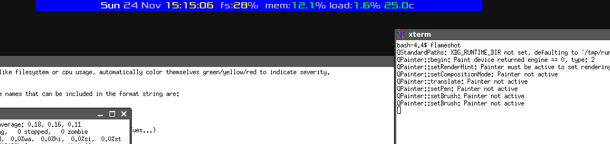
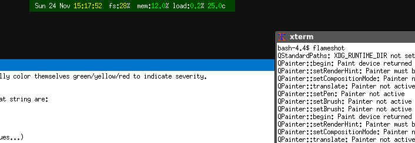
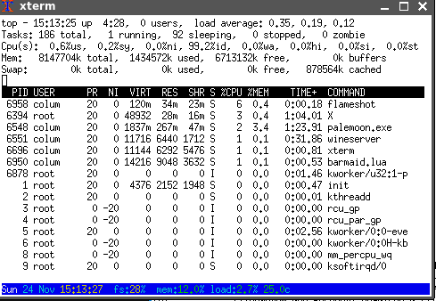
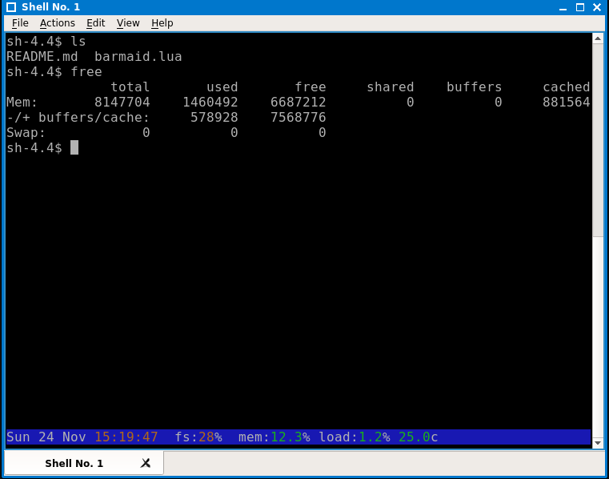

Barmaid.lua - a status bar tool for dzen2, lemonbar, xterm titles, dwm and ansi terminal
========================================================================================

SYNOPSIS
========

barmaid.lua is a status-bar generation program with unicode and modules support. It is written in lua using libUseful-lua. It can generate output suitable for dzen2, lemonbar, xterm title-bars, dwm and the terminal. It can display info on date, time, system load, memory usage, partition usage, cpu usage, ip4 address/netmask/broadcast, hostname, kernel, architecture, ostype, uptime, cpu count, battery level, wifi signal strength, cpu temperature and many other things. No external programs are run to generate this data, so barmaid's resource usage should be low. Unfortuantely, as barmaid pulls a lot of data from /proc and /sys, it's a mostly linux-only program. Barmaid is extensible via its modules system.


INSTALL
=======

You'll need to install libUseful (https://github.com/ColumPaget/libUseful) and libUseful-lua (https://github.com/ColumPaget/libUseful-lua) 

The program consists of one big script 'barmaid.lua'. The code is broken into parts, and can be rebuilt using the supplied makefile by typing 'make'.

If you run `make install` it will attempt to put `barmaid.lua` in `~/bin`, and `barmaid.conf` in `~/.config/barmaid.lua`. Modules shipped with barmaid.lua will be put in `~/.local/lib/barmaid/`.

If you run `make system_install` (which requires you being the 'root' user to succeed) then `barmaid.lua` will be copied to `/usr/local/bin`, the manpage will be copied to `/usr/local/share/man/man1/`  and modules will be copied to `/usr/local/lib/barmaid`.

The `make system_install` invocation can use a different install prefix than `/usr/local/` by providing a 'PREFIX' option on the command-line:

```
make system_install PREFIX=/usr
```

Once installed you can either run barmaid.lua using 'lua barmaid.lua' or use the linux binfmt system to auto invoke it.


USAGE
======


For detailed usage please consult manpage.md or the installed manpage.1


SCREENSHOTS
===========

## DZen



## Lemonbar



## Xterm



## QTerminal



